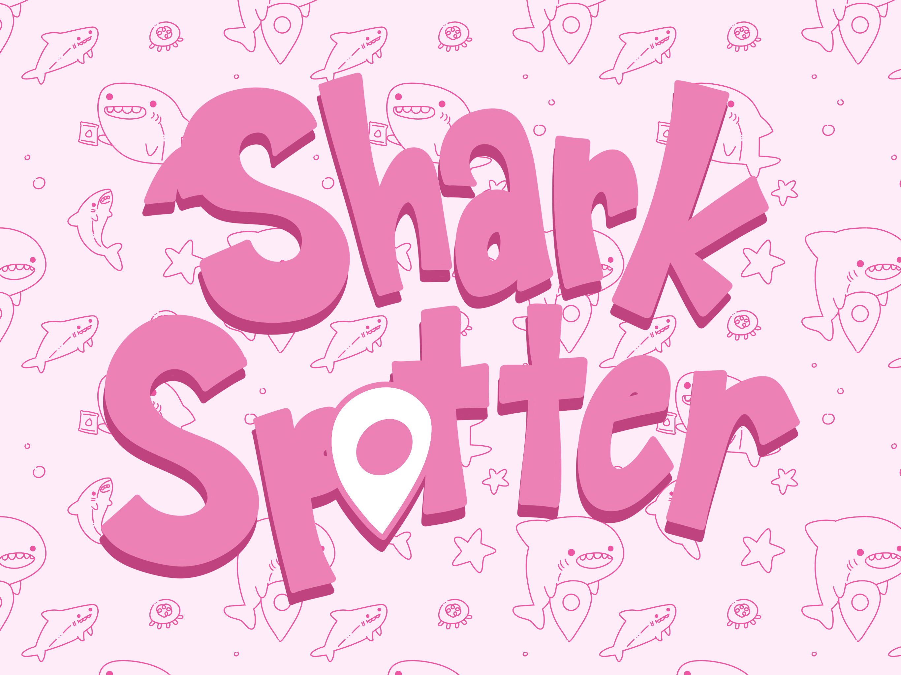
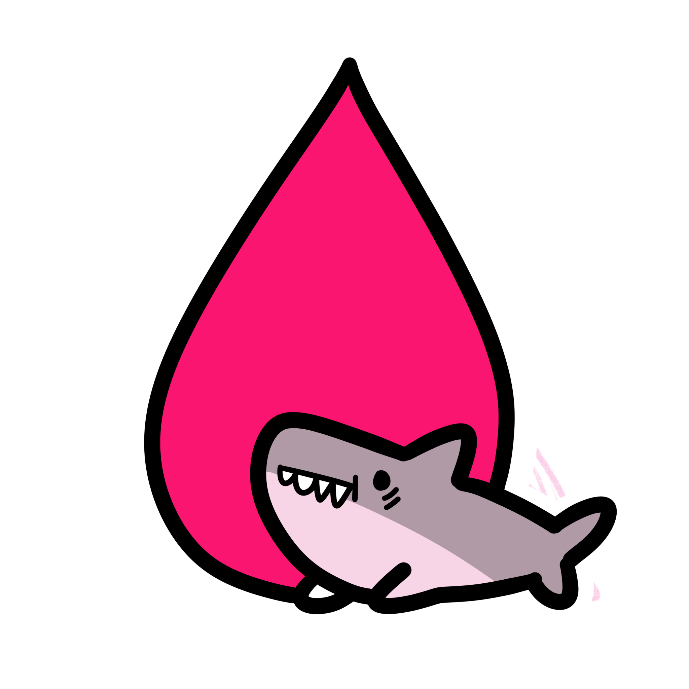
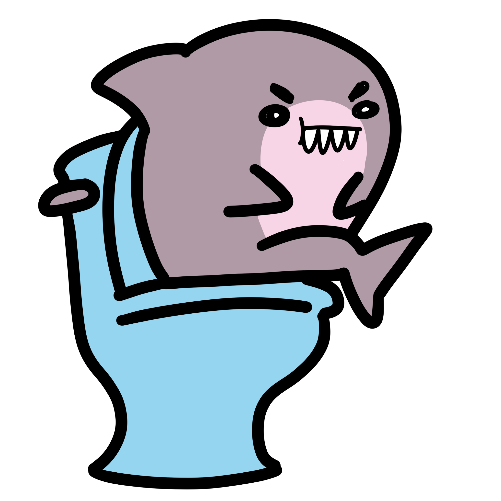

# sharkspotter

## Hello, welcome to our Venus Hacks 2025 Project!

Shark Spotter is a web application that crowdsources safety and period-support data for users on the go! People are able to create their own personal accounts, posting to and creating a community of fellow users. On the map, users can place pins ranging from feminine period products, bathrooms, and incidents to be aware of!

     
    

Through these available resources and information from users on dangers to look out for, females can create a safe place and support one another! A web application by women, for women.

To run SharkSpotter, cd into the backend folder and run "node server.js". In a separate terminal in the shark-spotter folder, run "ionic serve".
